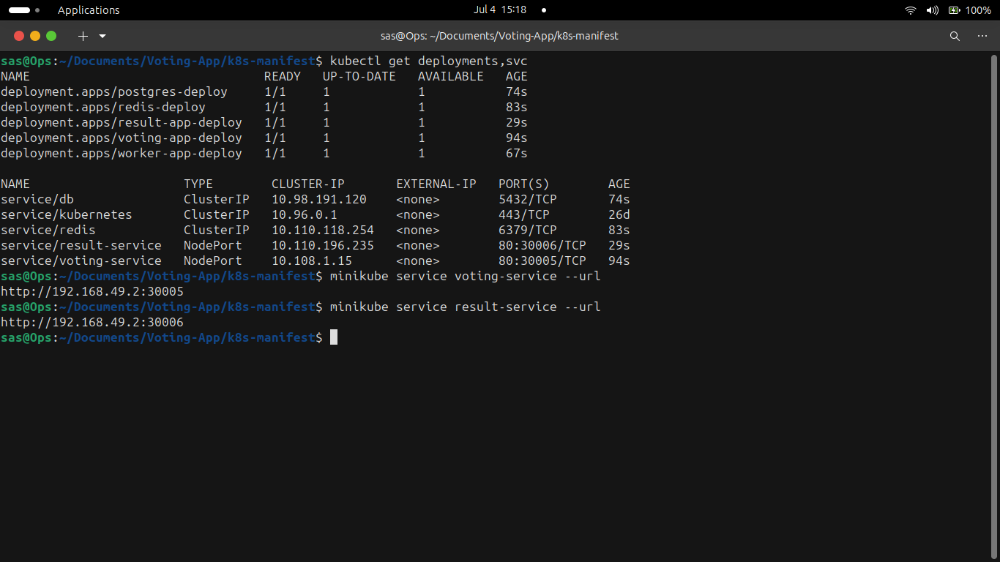
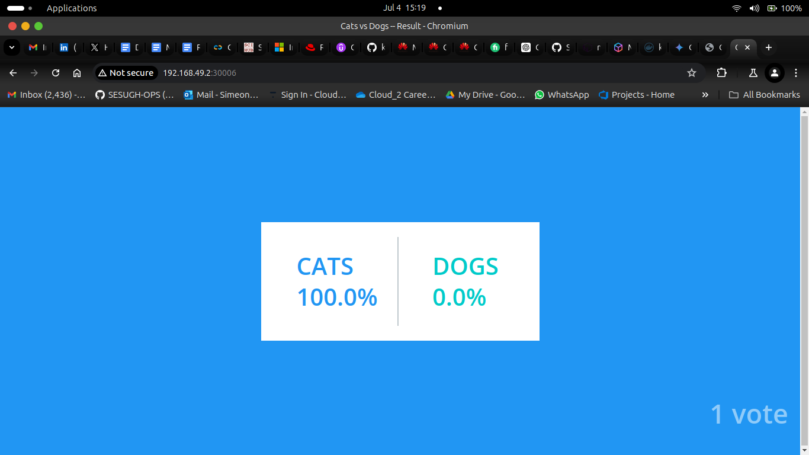

# *VOTING APP DEMO*

> **This is based on the original [example-voting-app](https://github.com/dockersamples/example-voting-app) repository from the [docker-examples](https://github.com/dockersamples) GitHub page and modified it to work on the Kubernetes cluster**

 ###### *BELOW IS THE WORKFLOW OF THE APPLICATION*
<div align="center">
   
</div>

 ### **STEPS TO DEPLOY THE APPLICATION TO A KUBERNETES CLUSTER**
 - *Before clonining the repository, ensure you have a running minikube cluster as this application is just a demo and for educational purpose.*

 - *Now run the command below to have your deployment files up and running*
  ```
  kubectl create -f Deployment <name of deployment file>
  ```
  > **The deployment files contain both the deployment and services workflow**
  
  - *You should have a running cluster looking like the image below*
  
  <div align="center">
   
</div>

 **The results and voting deployments serve as the frontend of the application**

  #### **The below commands gets you the url of both frontend pods**
   ```
   minikube service voting-service --url
   ```
   ```
   minikube service result-service --url
   ```
  ##### **The voting page looks like the image below**

  <div align="center">
     
  </div>

  ##### **After voting, results page looks like the image below**

  <div align="center">
     
  </div>


  